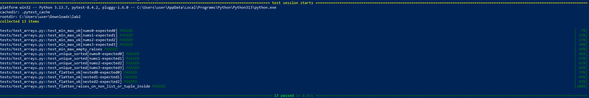
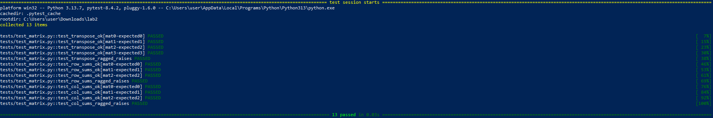
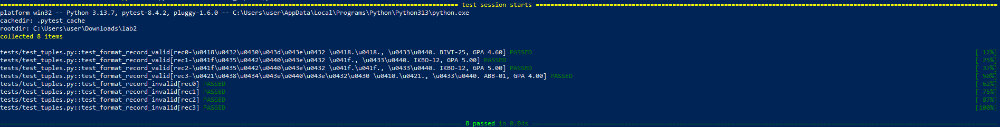

# ЛР2 — Коллекции и матрицы (list/tuple/set/dict)

## Структура
- Код: `src/lab02/`
- Скриншоты: `images/lab02/`

---

## Задание A — `arrays.py`
**Файл:** `01_arrays.py`  
**Реализуйте функции:** 
1. `min_max(nums: list[float | int]) -> tuple[float | int, float | int]`  
   Вернуть кортеж `(минимум, максимум)`. Если список пуст — `ValueError`.
2. `unique_sorted(nums: list[float | int]) -> list[float | int]`  
   Вернуть **отсортированный** список **уникальных** значений (по возрастанию).
3. `flatten(mat: list[list | tuple]) -> list`  
   «Расплющить» список списков/кортежей в один список по строкам (row-major).
   Если встретилась строка/элемент, который не является списком/кортежем — `TypeError`.

### Тест-кейсы (минимум)
**min_max**
- `[3, -1, 5, 5, 0]` → `(-1, 5)`
- `[42]` → `(42, 42)`
- `[-5, -2, -9]` → `(-9, -2)`
- `[]` → `ValueError`
- `[1.5, 2, 2.0, -3.1]` → `(-3.1, 2)`
**unique_sorted**
- `[3, 1, 2, 1, 3]` → `[1, 2, 3]`
- `[]` → `[]`
- `[-1, -1, 0, 2, 2]` → `[-1, 0, 2]`
- `[1.0, 1, 2.5, 2.5, 0]` → `[0, 1.0, 2.5]` *(допускаем смешение int/float)*
**flatten**
- `[[1, 2], [3, 4]]` → `[1, 2, 3, 4]`
- `[[1, 2], (3, 4, 5)]` → `[1, 2, 3, 4, 5]`
- `[[1], [], [2, 3]]` → `[1, 2, 3]`
- `[[1, 2], "ab"]` → `TypeError` *(«строка не строка строк матрицы»)*

### Код:
```
def min_max(nums):                                          #1
    if len(nums) == 0:
        raise ValueError('Список пуст')
    return (min(nums), max(nums))
def unique_sorted(nums):                                    #2
    return sorted(set(nums))

def flatten(mat):                                           #3
    result = []
    for row in mat:
        if type(row) != list and type(row) != tuple:
            raise TypeError('Строка/элемент не является списком/кортежем')
        result.extend(row)
    return result
```

**Скриншот:**  


---

## Задание B — `matrix.py`
**Файл:** `02_matrix.py`  
**Реализуйте функции:**
1. `transpose(mat: list[list[float | int]]) -> list[list]`  
   Поменять строки и столбцы местами. Пустая матрица `[]` → `[]`.  
   Если матрица «рваная» (строки разной длины) — `ValueError`.
2. `row_sums(mat: list[list[float | int]]) -> list[float]`  
   Сумма по каждой строке. Требуется прямоугольность (см. выше).
3. `col_sums(mat: list[list[float | int]]) -> list[float]`  
   Сумма по каждому столбцу. Требуется прямоугольность.

### Тест-кейсы (минимум)
**transpose**
- `[[1, 2, 3]]` → `[[1], [2], [3]]`
- `[[1], [2], [3]]` → `[[1, 2, 3]]`
- `[[1, 2], [3, 4]]` → `[[1, 3], [2, 4]]`
- `[]` → `[]`
- `[[1, 2], [3]]` → `ValueError` (рваная матрица)
**row_sums**
- `[[1, 2, 3], [4, 5, 6]]` → `[6, 15]`
- `[[-1, 1], [10, -10]]` → `[0, 0]`
- `[[0, 0], [0, 0]]` → `[0, 0]`
- `[[1, 2], [3]]` → `ValueError` (рваная)
**col_sums**
- `[[1, 2, 3], [4, 5, 6]]` → `[5, 7, 9]`
- `[[-1, 1], [10, -10]]` → `[9, -9]`
- `[[0, 0], [0, 0]]` → `[0, 0]`
- `[[1, 2], [3]]` → `ValueError` (рваная)

### Код:
```
def transpose(mat):                                         #1
    if len(mat) == 0:
        return []
    cols = len(mat[0])
    for row in mat:
        if len(row) != cols:
            raise ValueError('Строки разной длины')
    result = []
    for j in range(cols):
        new_row = []
        for i in range(len(mat)):
            new_row.append(mat[i][j])
        result.append(new_row)
    return result
def row_sums(mat):                                          #2
    if len(mat) == 0:
        return []
    cols = len(mat[0])
    for row in mat:
        if len(row) != cols:
            raise ValueError('Строки разной длины')
    sums = []
    for row in mat:
        total = 0
        for x in row:
            total += x
        sums.append(total)
    return sums
def col_sums(mat):                                          #3
    if len(mat) == 0:
        return []
    cols = len(mat[0])
    for row in mat:
        if len(row) != cols:
            raise ValueError('Строки разной длины')
    sums = [0] * cols
    for row in mat:
        for j in range(cols):
            sums[j] += row[j]
    return sums
```
    
**Скриншот:**  


---

## Задание C — `tuples.py`
**Файл:** `03_tuples.py`  
**Работаем с «записями» как с кортежами** 
1. Определите тип записи студента как кортеж:  
   `(fio: str, group: str, gpa: float)`
2. Реализуйте `format_record(rec: tuple[str, str, float]) -> str`  
   Вернуть строку вида:  
   `Иванов И.И., гр. BIVT-25, GPA 4.60`  
   **Правила:**
   - ФИО может быть `«Фамилия Имя Отчество»` или `«Фамилия Имя»` — инициалы формируются из 1–2 имён (в верхнем регистре).
   - Лишние пробелы нужно убрать (`strip`, «схлопнуть» внутри).
   - GPA печатается с **2 знаками** (округление правилами Python).

### Тест-кейсы (минимум)
- `("Иванов Иван Иванович", "BIVT-25", 4.6)` → `"Иванов И.И., гр. BIVT-25, GPA 4.60"`
- `("Петров Пётр", "IKBO-12", 5.0)` → `"Петров П., гр. IKBO-12, GPA 5.00"`
- `("Петров Пётр Петрович", "IKBO-12", 5.0)` → `"Петров П.П., гр. IKBO-12, GPA 5.00"`
- `("  сидорова  анна   сергеевна ", "ABB-01", 3.999)` → `"Сидорова А.С., гр. ABB-01, GPA 4.00"`
- Некорректные записи (пустое ФИО, пустая группа, неверный тип GPA) → `ValueError`/`TypeError` по усмотрению (описать в докстринге).

### Код:
```
def format_record(rec):                                     #1
    if type(rec) is not tuple or len(rec) != 3:
        raise ValueError('Ожидается кортеж из 3 элементов')
    fio = rec[0]
    group = rec[1]
    gpa = rec[2]
    if type(gpa) not in (int, float):
        raise TypeError('GPA введён неверно')
    if type(fio) is not str or len(fio.strip()) == 0:
        raise ValueError('ФИО введены неверно')
    if type(group) is not str or len(group.strip()) == 0:
        raise ValueError('Группа введена неверно')
    group = group.strip()
    parts = fio.strip().split()
    if len(parts) < 2:
        raise ValueError('ФИО должно содержать минимум фамилию и имя')
    surname = parts[0].capitalize()
    initials = ''
    for name in parts[1:3]:
        initials += name[0].upper() + '.'
    return f'{surname} {initials}, гр. {group}, GPA {gpa:.2f}'
```
    
**Скриншот:**  


---
