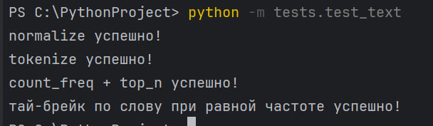
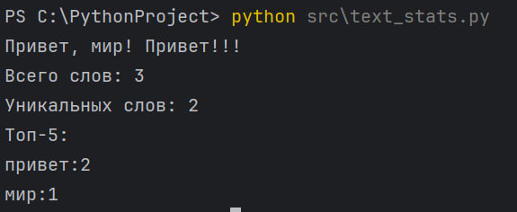

# ЛР3 — Тексты и частоты слов (словарь/множество)

## Структура
- Код: `src/lab03/`
- Скриншоты: `images/lab03/`

---

## Задание A — `src/lib/text.py`
**Файл:** `text.py`  
**Реализуйте функции:** 
1. `normalize(text: str, *, casefold: bool = True, yo2e: bool = True) -> str`  
   - Если `casefold=True` — привести к **casefold** (лучше, чем `lower` для Юникода).  
   - Если `yo2e=True` — заменить все `ё`/`Ё` на `е`/`Е`.  
   - Убрать невидимые управляющие символы (например, `\t`, `\r`) → заменить на пробелы, схлопнуть повторяющиеся пробелы в один.
2. `tokenize(text: str) -> list[str]`  
   - Разбить на «слова» по небуквенно-цифровым разделителям.  
   - В качестве слова считаем последовательности символов `\w` (буквы/цифры/подчёркивание) **плюс** дефис внутри слова (например, `по-настоящему`).  
   - Числа (например, `2025`) считаем словами.
3. `count_freq(tokens: list[str]) -> dict[str, int]`  
   - Подсчитать частоты, вернуть словарь `слово → количество`.
4. `top_n(freq: dict[str, int], n: int = 5) -> list[tuple[str, int]]`  
   - Вернуть топ-N по убыванию частоты; при равенстве — по алфавиту слова.

### Код:
```
def normalize(text: str, *, casefold: bool = True, yo2e: bool = True):              #1
    s = text
    if casefold:
        s = s.casefold()
    if yo2e:
        s = s.replace('ё', 'е')
    s = s.replace('\t', ' ').replace('\r', ' ').replace('\n', ' ')
    s = ' '.join(s.split())
    return s
def tokenize(text):                                                                  #2
    tokens = []
    word = ''
    for ch in text:
        if ch.isalnum() or ch == '_':
            word += ch
        elif ch == '-' and word:
            word += '-'
        else:
            if word:
                tokens.append(word)
                word = ''
    if word:
        tokens.append(word)
    return tokens
def count_freq(tokens):                                                              #3
    freq = {}
    for word in tokens:
        freq[word] = freq.get(word, 0) + 1
    return freq
def top_n(freq, n=5):                                                                #4
    result = sorted(freq.items(), key=lambda pair: (-pair[1], pair[0]))
    return result[:n]
```

### Проверка:
**Код:**
```
from src.lib.text import normalize, tokenize, count_freq, top_n
assert normalize("ПрИвЕт\nМИр\t") == "привет мир"                                   #1
assert normalize("ёжик, Ёлка") == "ежик, елка"
assert normalize("Hello\r\nWorld") == "hello world"
assert normalize("  двойные   пробелы  ") == "двойные пробелы"

print("normalize успешно!")
assert tokenize("привет, мир!") == ["привет", "мир"]                                #2
assert tokenize("по-настоящему круто") == ["по-настоящему", "круто"]
assert tokenize("2025 год") == ["2025", "год"]
assert tokenize("hello,world!!!") == ["hello", "world"]
assert tokenize("emoji 😀 не слово") == ["emoji", "не", "слово"]
print("tokenize успешно!")

freq = count_freq(["a","b","a","c","b","a"])                                        #3
assert freq == {"a":3, "b":2, "c":1}
assert top_n(freq, 2) == [("a",3), ("b",2)]
print("count_freq + top_n успешно!")

freq2 = count_freq(["bb","aa","bb","aa","cc"])                                      #4
assert top_n(freq2, 2) == [("aa",2), ("bb",2)]
print("тай-брейк по слову при равной частоте успешно!")
```
**Результат:**



---

## Задание B — `src/text_stats.py`
**Файл:** `text_stats.py`  
Скрипт читает одну строку текста из **stdin**, вызывает функции из `lib/text.py` и печатает:
1. `Всего слов: <N>`  
2. `Уникальных слов: <K>`  
3. `Топ-5:` — по строке на запись в формате `слово:кол-во` (по убыванию, как в `top_n`).

### Код:
```
from lib.text import normalize, tokenize, count_freq, top_n                         #1
text = input()
text = normalize(text)
tokens = tokenize(text)
freq = count_freq(tokens)
top = top_n(freq, 5)
print("Всего слов:", len(tokens))
print("Уникальных слов:", len(freq))
print("Топ-5:")
for word, count in top:
    print(f"{word}:{count}")
```

**Скриншот:**



---
