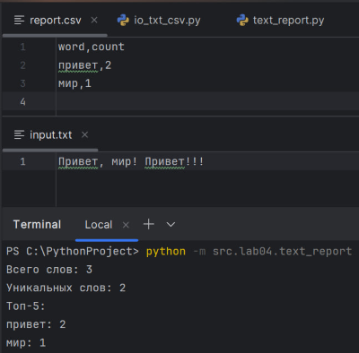
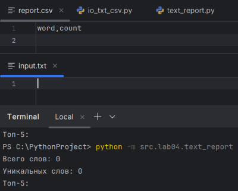
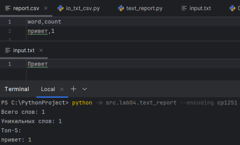

# ЛР3 — Файлы: TXT/CSV и отчёты по текстовой статистике

## Структура
- Код:*[Задание А](io_txt_csv.py/)*
- 
      *[Задание В](text_report.py/)*
- Скриншоты: `images/lab04/`

---

## Задание A — модуль `src/lab04/io_txt_csv.py`
**Файл:** `io_txt_csv.py`  
**Реализуйте:** 
1. `read_text(path: str | Path, encoding: str = "utf-8") -> str`  
   - Открыть файл на чтение в указанной кодировке и вернуть содержимое **как одну строку**;  
   - Обрабатывать ошибки: если файл не найден — поднимать `FileNotFoundError` (пусть падает), если кодировка не подходит — поднимать `UnicodeDecodeError` (пусть падает);  
   - НО: в докстринге опишите, как пользователь может выбрать другую кодировку (пример: `encoding="cp1251"`).
2. `write_csv(rows: list[tuple | list], path: str | Path, header: tuple[str, ...] | None = None) -> None`  
   - Создать/перезаписать CSV с разделителем `,`;  
   - Если передан `header`, записать его первой строкой;  
   - Проверить, что каждая строка в `rows` имеет одинаковую длину (иначе `ValueError`).
### Код:
```
from pathlib import Path
import csv

def read_text(path, encoding = "utf-8"):                        #1
    """ Можно выбрать другую кодировку (пример: encoding="cp1251") """
    p = Path(path)
    return p.read_text(encoding=encoding)

def write_csv(rows, path, header=None):                         #2
    rows = list(rows)
    if rows:
        cols = len(rows[0])
        for r in rows:
            if len(r) != cols:
                raise ValueError("Строки разной длины")

    with open(path, "w", encoding="utf-8", newline="") as f:
        writer = csv.writer(f)
        if header is not None:
            writer.writerow(header)
        for r in rows:
            writer.writerow(r)
```

---

## Задание B — скрипт `src/lab04/text_report.py`
**Файл:** `text_report.py`  
**Скрипт, который:**  
1) Читает **один** входной файл `data/input.txt`; 
2) Нормализует текст (`lib/text.py`), токенизирует и считает частоты слов;  
3) Сохраняет `data/report.csv` c колонками: **`word,count`**, отсортированными: count ↓, слово ↑ (при равенстве);  
4) В консоль печатает краткое резюме:  
   - `Всего слов: <N>`  
   - `Уникальных слов: <K>`  
   - `Топ-5:`.
### Код:
```
from src.lab04.io_txt_csv import read_text, write_csv
from src.lib.text import count_freq, top_n, normalize, tokenize
from pathlib import Path

def frequencies_from_text(text):
    tokens = tokenize(normalize(text))
    freq = count_freq(tokens)
    return tokens, freq

in_path = Path("data/lab04/input.txt")
out_path = Path("data/lab04/report.csv")

text = read_text(in_path)
tokens, freq = frequencies_from_text(text)
write_csv(top_n(freq, len(freq)), out_path, header=("word", "count"))

print("Всего слов:", len(tokens))
print("Уникальных слов:", len(freq))
print("Топ-5:")
for word, count in top_n(freq, 5):
    print(f"{word}: {count}")
```

---

### Проверка:
### A. Один файл (база)
**Вход (`data/input.txt`):**
```
Привет, мир! Привет!!!
```
**Ожидаем `report.csv`:**
```
word,count
привет,2
мир,1
```
**Консоль:**
```
Всего слов: 3
Уникальных слов: 2
Топ-5:
привет:2
мир:1
```




### B. Пустой файл
**Вход:** пустой `data/input.txt`  
**Ожидание:** `report.csv` содержит только заголовок `word,count`





### C. Кодировка cp1251
**Вход:** `data/input.txt` в `cp1251` с текстом `Привет`  
**Действие:** `python src/lab04/text_report.py --in data/input.txt --encoding cp1251`  
**Ожидание:** корректное чтение и отчёт `привет,1`.




---
