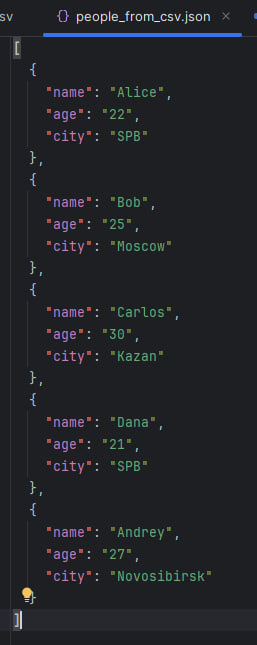
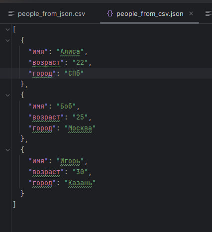
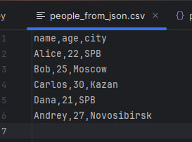
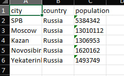
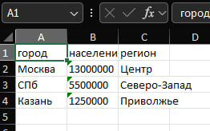

# ЛР5 — JSON и конвертации (JSON↔CSV, CSV→XLSX): Техническое задание

## Структура
- Код:*[Задание А](json_csv.py/)*
      *[Задание В](csv_xlsx.py/)*
- Скриншоты: `images/lab05/`

---

## Задание A — модуль `src/lab05/json_csv.py`
**Файл:** `json_csv.py`  
**Реализуйте:** 
```python
def json_to_csv(json_path: str, csv_path: str) -> None:
    """
    Преобразует JSON в CSV.
    Порядок колонок — как в первом объекте.
    """
def csv_to_json(csv_path: str, json_path: str) -> None:
    """
    Преобразует CSV в JSON.
    Заголовок обязателен, значения сохраняются как строки.
    """
```
### Код:
```
import json, csv
from pathlib import Path

def json_to_csv(json_path: str, csv_path: str) -> None:     #1
    jp = Path(json_path)
    if jp.suffix != ".json":
        raise ValueError("Неверный тип файла")
    if not jp.exists():
        raise FileNotFoundError("Файл не найден")
    with open(json_path,"r", encoding="utf-8") as f:
        data = json.load(f)
    if len(data)==0:
        raise ValueError("Пустой JSON")
    headers = list(data[0])
    with open(csv_path, "w", newline="", encoding="utf-8") as f:
        writer = csv.DictWriter(f, fieldnames=headers)
        writer.writeheader()
        writer.writerows(data)

def csv_to_json(csv_path: str, json_path: str) -> None:     #2
    cp = Path(csv_path)
    if cp.suffix != ".csv":
        raise ValueError("Неверный тип файла")
    if not cp.exists():
        raise FileNotFoundError("Файл не найден")
    with open(csv_path,"r", encoding="utf-8") as f:
        reader = csv.DictReader(f)
        rows = list(reader)
    if len(rows) == 0:
        raise ValueError("Пустой CSV")
    with open(json_path,"w", encoding="utf-8") as f:
        json.dump(rows, f, ensure_ascii=False, indent=2)
```

---

## Задание B — модуль `src/lab05/csv_xlsx.py`
**Файл:** `csv_xlsx.py`  
**Реализуйте:** 
```python
def csv_to_xlsx(csv_path: str, xlsx_path: str) -> None:
    """
    Конвертирует CSV в XLSX.
    Использовать openpyxl.
    Первая строка CSV — заголовок.
    """
```
### Код:
```
import csv
from pathlib import Path
from openpyxl import Workbook

def csv_to_xlsx(csv_path: str, xlsx_path: str) -> None:
    cp = Path(csv_path)
    if cp.suffix != ".csv":
        raise ValueError("Неверный тип файла")
    if not cp.exists():
        raise FileNotFoundError("Файл не найден")
    with open(csv_path, "r", encoding="utf-8") as f:
        reader = csv.reader(f)
        rows = list(reader)
    if len(rows)==0:
        raise ValueError("Пустой CSV")
    wb = Workbook()
    ws = wb.active
    ws.title = "Sheet1"
    for row in rows:
        ws.append(row)
    wb.save(xlsx_path)
```

---

### Проверка:
### Задание A.
**people.csv**
```
name,age,city
Alice,22,SPB
Bob,25,Moscow
Carlos,30,Kazan
Dana,21,SPB
Andrey,27,Novosibirsk
```
**people_from_csv.json**



**people.csv**
```
имя,возраст,город
Алиса,22,СПб
Боб,25,Москва
Игорь,30,Казань
```
**people_from_csv.json**



**people.json**
```
[
  {
    "name": "Alice",
    "age": 22,
    "city": "SPB"
  },
  {
    "name": "Bob",
    "age": 25,
    "city": "Moscow"
  },
  {
    "name": "Carlos",
    "age": 30,
    "city": "Kazan"
  },
  {
    "name": "Dana",
    "age": 21,
    "city": "SPB"
  },
  {
    "name": "Andrey",
    "age": 27,
    "city": "Novosibirsk"
  }
]
```
**people_from_json.csv**


**people.json**
```
[
  {"имя": "Алиса", "возраст": 22, "город": "СПб"},
  {"имя": "Боб",   "возраст": 25, "город": "Москва"},
  {"имя": "Игорь", "возраст": 30, "город": "Казань"}
]
```
**people_from_json.csv** 


**cities.csv**
```
city,country,population
SPB,Russia,5384342
Moscow,Russia,13010112
Kazan,Russia,1306953
Novosibirsk,Russia,1620162
Yekaterinburg,Russia,1493749
```
**cities.xlsx**



**cities.csv**
```
город,население,регион
Москва,13000000,Центр
СПб,5500000,Северо-Запад
Казань,1250000,Приволжье
```
**cities.xlsx**


---
