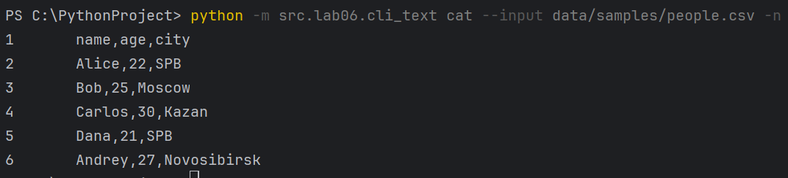
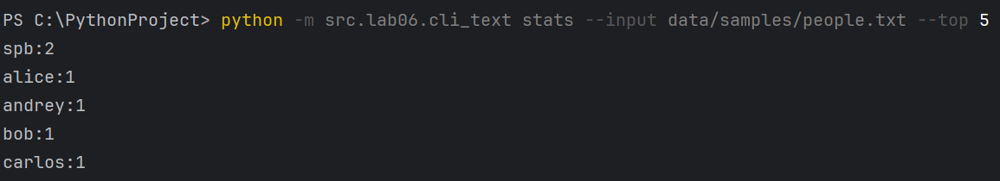
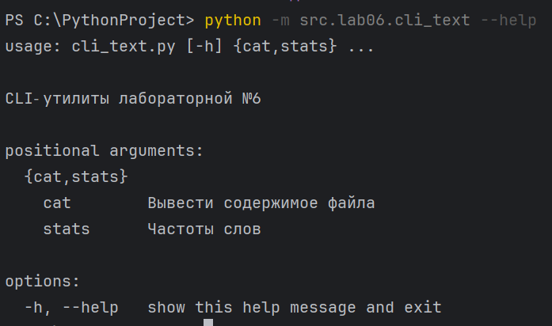
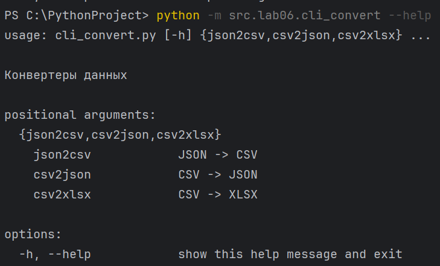
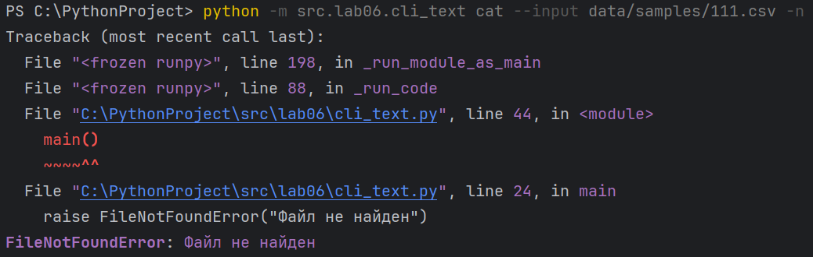
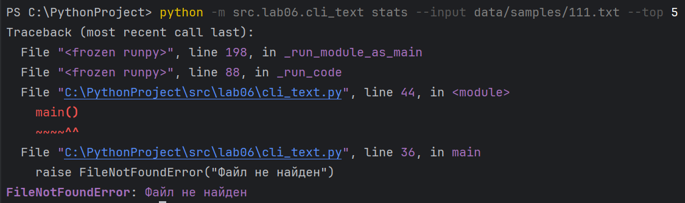
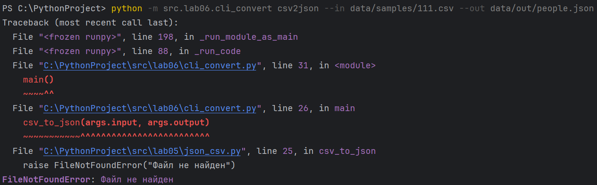

# ЛР6 — CLI‑утилиты с argparse (cat/grep‑lite + конвертеры): Техническое задание

## Структура
- Код:*[Задание А](cli_text.py/)*
      *[Задание В](cli_convert.py/)*
- Скриншоты: `images/lab06/`

---

## Задание A — модуль `src/lab06/cli_text.py`
**Файл:** `cli_text.py`  
**Реализуйте модуль с подкомандами:** 
  - `stats --input <txt> [--top 5]` — анализ частот слов в тексте (использовны функции из `lab04`);
  - `cat --input <path> [-n]` — вывод содержимого файла построчно (с нумерацией при `-n`).

### Код:
```
import argparse
from pathlib import Path
from src.lib.text import normalize, tokenize, count_freq, top_n

def main():
    parser = argparse.ArgumentParser(description="CLI‑утилиты лабораторной №6")
    subparsers = parser.add_subparsers(dest="command", required=True)

    # подкоманда cat
    cat_parser = subparsers.add_parser("cat", help="Вывести содержимое файла")
    cat_parser.add_argument("--input", required=True)
    cat_parser.add_argument("-n", action="store_true", help="Нумеровать строки")

    # подкоманда stats
    stats_parser = subparsers.add_parser("stats", help="Частоты слов")
    stats_parser.add_argument("--input", required=True)
    stats_parser.add_argument("--top", type=int, default=5)

    args = parser.parse_args()

    if args.command == "cat":
        p = Path(args.input)
        if not p.exists():
            raise FileNotFoundError("Файл не найден")
        with p.open("r", encoding="utf-8") as f:
            for i, line in enumerate(f, 1):
                line = line.rstrip("\n")
                if args.n:
                    print(f"{i}\t{line}")
                else:
                    print(line)

    elif args.command == "stats":
        p = Path(args.input)
        if not p.exists():
            raise FileNotFoundError("Файл не найден")
        text = p.read_text(encoding="utf-8")
        tokens = tokenize(normalize(text))
        freq = count_freq(tokens)
        for word, count in top_n(freq, args.top):
            print(f"{word}:{count}")

if __name__ == "__main__":
    main()
```

---

## Задание B — модуль `src/lab06/cli_convert.py`
**Файл:** `cli_convert.py`  
**Реализуйте модуль с подкомандами:** 
  - `json2csv --in data/samples/people.json --out data/out/people.csv`  
  - `csv2json --in data/samples/people.csv --out data/out/people.json`  
  - `csv2xlsx --in data/samples/people.csv --out data/out/people.xlsx`

### Код:
```
import argparse
from src.lab05.json_csv import json_to_csv, csv_to_json
from src.lab05.csv_xlsx import csv_to_xlsx

def main():
    parser = argparse.ArgumentParser(description="Конвертеры данных")
    sub = parser.add_subparsers(dest="cmd", required=True)

    p1 = sub.add_parser("json2csv", help="JSON -> CSV")
    p1.add_argument("--in", dest="input", required=True)
    p1.add_argument("--out", dest="output", required=True)

    p2 = sub.add_parser("csv2json", help="CSV -> JSON")
    p2.add_argument("--in", dest="input", required=True)
    p2.add_argument("--out", dest="output", required=True)

    p3 = sub.add_parser("csv2xlsx", help="CSV -> XLSX")
    p3.add_argument("--in", dest="input", required=True)
    p3.add_argument("--out", dest="output", required=True)

    args = parser.parse_args()

    if args.cmd == "json2csv":
        json_to_csv(args.input, args.output)
    elif args.cmd == "csv2json":
        csv_to_json(args.input, args.output)
    elif args.cmd == "csv2xlsx":
        csv_to_xlsx(args.input, args.output)

if __name__ == "__main__":
    main()
```

---

### Проверка:
**cat --input data/samples/people.csv -n → вывод строк с номерами**


**stats --input data/samples/people.txt --top 5 → вывод топ‑слов**


**--help**



**вывод ошибок**





---
