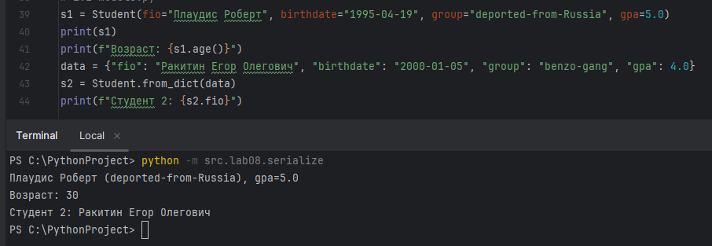
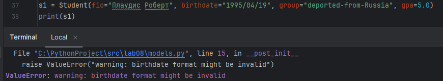
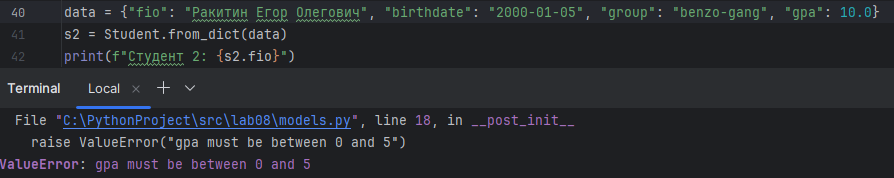
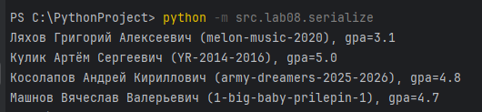
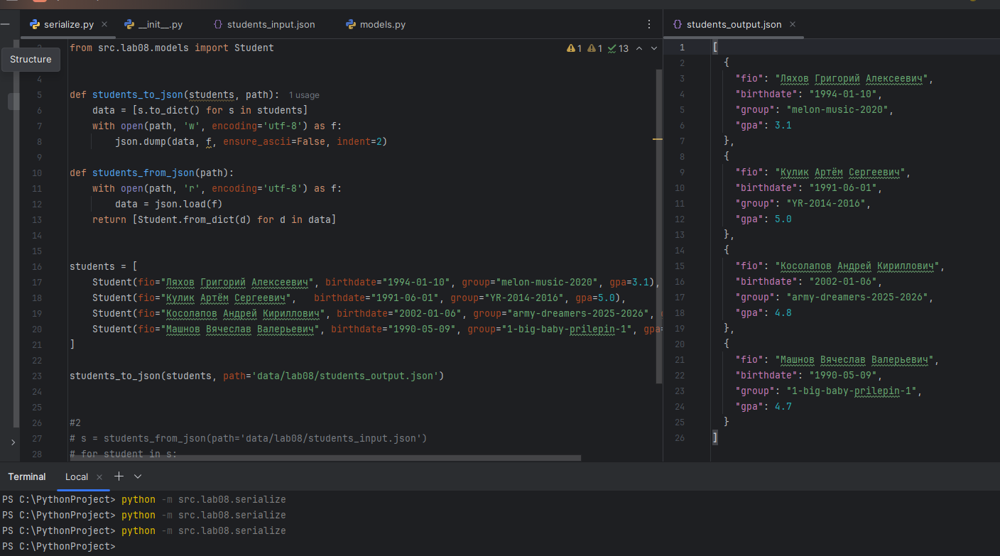

# ЛР8 – ООП в Python: `@dataclass Student`, методы и сериализация

## Задание A — Реализовать класс `Student`
**Файл:** `models.py`  
### Код:
```
from dataclasses import dataclass
from datetime import datetime, date

@dataclass
class Student:
    fio: str
    birthdate: str
    group: str
    gpa: float

    def __post_init__(self):
        try:
            datetime.strptime(self.birthdate, "%Y-%m-%d")
        except ValueError:
            raise ValueError("warning: birthdate format might be invalid")

        if not (0 <= self.gpa <= 5):
            raise ValueError("gpa must be between 0 and 5")

    def age(self):
        b = datetime.strptime(self.birthdate, "%Y-%m-%d").date()
        today = date.today()
        return today.year - b.year - ((today.month, today.day) < (b.month, b.day))

    def to_dict(self):
        return {
            "fio": self.fio,
            "birthdate": self.birthdate,
            "group": self.group,
            "gpa": self.gpa,
        }

    @classmethod
    def from_dict(cls, d: dict):
        return cls(
            fio=d["fio"],
            birthdate=d["birthdate"],
            group=d["group"],
            gpa=d["gpa"],
        )

    def __str__(self):
        return f"{self.fio} ({self.group}), gpa={self.gpa}"

```

---

## Задание B — Реализовать модуль `serialize.py`
**Файл:** `serialize.py`  
### Код:
```
import json
from src.lab08.models import Student


def students_to_json(students, path):
    data = [s.to_dict() for s in students]
    with open(path, 'w', encoding='utf-8') as f:
        json.dump(data, f, ensure_ascii=False, indent=2)

def students_from_json(path):
    with open(path, 'r', encoding='utf-8') as f:
        data = json.load(f)
    return [Student.from_dict(d) for d in data]


# 1.1 models.py
# s1 = Student(fio="Плаудис Роберт", birthdate="1995-04-19", group="deported-from-Russia", gpa=5.0)
# rint(s1)
# print(f"Возраст: {s1.age()}")
# data = {"fio": "Ракитин Егор Олегович", "birthdate": "2000-01-05", "group": "benzo-gang", "gpa": 4.0}
# s2 = Student.from_dict(data)
# print(f"Студент 2: {s2.fio}")

# 1.2 models.py ошибки
# s1 = Student(fio="Плаудис Роберт", birthdate="1995/04/19", group="deported-from-Russia", gpa=5.0)
# print(s1)
# data = {"fio": "Ракитин Егор Олегович", "birthdate": "2000-01-05", "group": "benzo-gang", "gpa": 10.0}
# s2 = Student.from_dict(data)
# print(f"Студент 2: {s2.fio}")

# 2 students_to_json
# students = [
#    Student(fio="Ляхов Григорий Алексеевич", birthdate="1994-01-10", group="melon-music-2020", gpa=3.1),
#    Student(fio="Кулик Артём Сергеевич",   birthdate="1991-06-01", group="YR-2014-2016", gpa=5.0),
#    Student(fio="Косолапов Андрей Кириллович", birthdate="2002-01-06", group="army-dreamers-2025-2026", gpa=4.8),
#    Student(fio="Машнов Вячеслав Валерьевич", birthdate="1990-05-09", group="1-big-baby-prilepin-1", gpa=4.7),
# ]
# students_to_json(students, path='data/lab08/students_output.json')

#3 students_from_json
# s = students_from_json(path='data/lab08/students_input.json')
# for student in s:
#    print(student)
```

---

### Результаты тестов:










---
